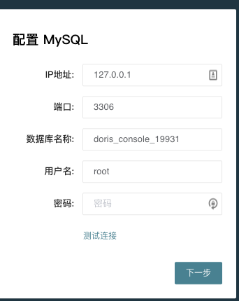
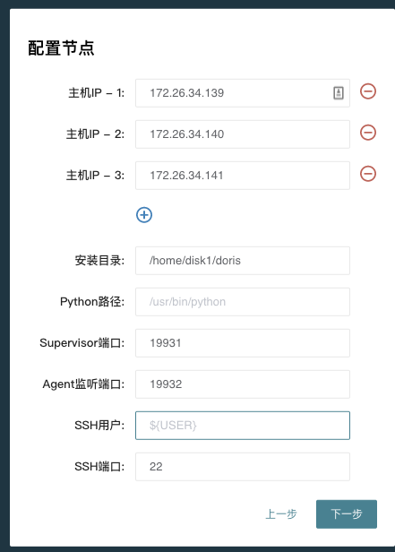
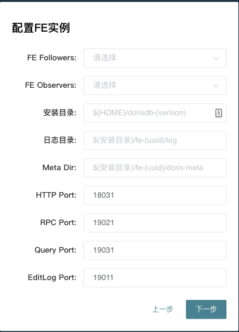
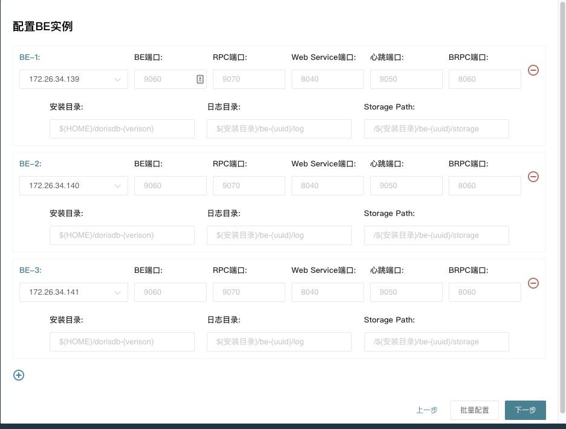
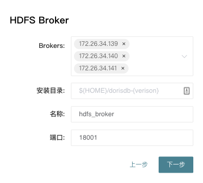
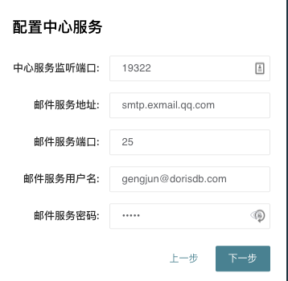

# 8.1 集群部署

\[TOC\] DorisDB的集群部署有两种模式，一种是使用基础的二进制手工部署，第二种是使用DorisManager自动化部署。自动部署的版本只需要在页面上简单配置选择后批量完成，并且包含Supervisor进程管理、滚动升级、备份、回滚等功能。手工部署的方式适用于希望和自有运维系统打通的用户，也有助于管理员理解DorisDB的内部运行机制，直接定位处理一些更复杂的问题。

## 8.1.1 DorisManager部署

### 8.1.1.1 安装依赖

在所有需要部署DorisDB的节点上安装以下依赖:

* JDK \(1.8 以上\)  并且配置好JAVA\_HOME \(比如 ~/.bashrc中增加export \).
* python \(2.7 以上\)
* python-setuptools \(yum install setuptools or apt-get install setuptools\)

另外DorisManager本身需要连接一个Mysql来存储数据

### 8.1.1.2 安装DorisManager部署工具

解压以后

```text
$ bin/install.sh -h
-[d install_path] install_path(default: /home/disk1/doris/dorisdb-manager-20200101)
-[y python_bin_path] python_bin_path(default: /usr/bin/python)
-[p admin_console_port] admin_console_port(default: 19321)
-[s supervisor_http_port] supervisor_http_port(default: 19320)
$ bin/install.sh
```

该步骤会安装一个简单的web页面 来帮助你

### 8.1.1.3 安装部署DorisDB

* 首先需要配置一个mysql，这个Mysql用于存储DorisManager的管理，查询，报警等信息



* 选择需要部署的节点，以及agent和supervisor的安装目录，agent负责采集机器的统计信息，Supervisor管理进程的启动停止，所有安装都在用户环境，不会影响系统环境。



* 安装FE： meta dir就是DorisDB的元数据目录，和手动安装类似，建议配置一个独立的doris-meta和fe log 目录，FE follower建议配置1或者3个，在请求压力比较大的情况可以酌情增加observer



* 安装BE： 端口的含义接受参考



* 安装Broker，建议在所有节点上都安装Broker。



* 安装center service:  center service负责从agent拉去信息汇总存储，并提供监控报警的服务，这里的邮件服务是用来发送通知报警的邮箱，也可以填空，以后再配置。



### 8.1.1.4 端口列表

| 实例名称 | 端口名称 | 默认端口 | 通讯方向 | 说明 |
| :--- | :--- | :--- | :--- | :--- |
| BE | be\_port | 9060 | FE --&gt; BE | BE 上 thrift server 的端口，用于接收来自 FE 的请求 |
| BE | webserver\_port | 8040 | BE &lt;--&gt; BE | BE 上的 http server 的端口 |
| BE | heartbeat\_service\_port | 9050 | FE --&gt; BE | BE 上心跳服务端口（thrift），用于接收来自 FE 的心跳 |
| BE | brpc\_port | 8060 | FE&lt;--&gt;BE BE &lt;--&gt; BE | BE 上的 brpc 端口，用于 BE 之间通讯 |
| FE | http\_port | 8030 | FE &lt;--&gt; FE 用户 | FE 上的 http server 端口 |
| FE | rpc\_port | 9020 | BE --&gt; FE FE &lt;--&gt; FE | FE 上的 thrift server 端口 |
| FE | query\_port | 9030 | 用户 | FE 上的 mysql server 端口 |
| FE | edit\_log\_port | 9010 | FE &lt;--&gt; FE | FE 上的 bdbje 之间通信用的端口 |
| Broker | broker\_ipc\_port | 8000 | FE --&gt; Broker BE --&gt; Broker | Broker 上的 thrift server，用于接收请求 |

## 8.1.2 手动部署

手动部署参考 “[2.3 DorisDB手动部署](../2.-kuai-su-kai-shi/)”

