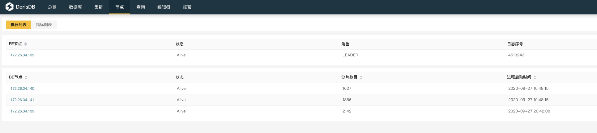
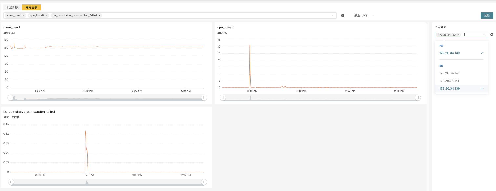

[TOC]
DorisDB提供两种监控报警的方案，第一种是使用内置的DorisManager，其自带的Agent从各个Host采集监控信息上报到Center Service然后做可视化展示，也提供了邮件和Webhook的方式发送报警通知。但是如果用户为了二次开发需求，需要自己搭建部署监控服务，也可以使用开源的Prometheus+Grafana的方案，DorisDB提供了兼容Prometheus的信息采集接口，可以通过直接链接BE/FE的HTTP端口来获取集群的监控信息。

### 8.10.1 使用DorisManager

DorisManager的监控可以分成**集群**和**节点**两个维度，在集群页面可以看到下列监控项：

* 集群性能监控
    *   CPU使用率
    *   内存使用
    *   磁盘I/O使用率，磁盘使用量、磁盘空闲量
    *   发包带宽、收包带宽，发包数、收包数
* 集群查询监控
    *   QPS
    *   平均响应时间
    *   50/75/90/95/99/999 分位响应时间
* 数据导入量监控
    *   发起导入次数
    *   导入行数
    *   导入数据量
*   数据组合并（Compaction）监控
    *   基线合并数据组速率
    *   基线合并数据量
    *   增量合并数据组速率
    *   增量合并数据量

在节点页面可以看到所有BE/FE的机器列表和状态等基础信息

点击节点链接可以看到每一个节点的详细监控信息，可以在右侧的节点列表中选择多个节点同时展示，可以在上方的下拉框中选择各类指标

 

### 8.10.2 监控指标

可供选择的指标有：

  |指标|单位|类型|含义|
|---|:---:|:---:|---|
|be_broker_count|个|平均值|broker的数量|
|be_brpc_endpoint_count|个|平均值|Brpc中StubCache的数量|
|be_bytes_read_per_second|bytes/s|平均值|BE 读取速度|
|be_bytes_written_per_second|bytes/s|平均值|BE 写入速度|
|be_base_compaction_bytes_per_second|bytes/s|平均值|BE 的基线合并速率|
|be_cumulative_compaction_bytes_per_second|bytes/s|平均值|BE 的增量合并速率|
|be_base_compaction_rowsets_per_second|rowsets/s|平均值|BE的基线合并rowsets合并速率|
|be_cumulative_compaction_rowsets_per_second|rowsets/s|平均值|BE的增量合并rowsets合并速率|
|be_base_compaction_failed|个/秒|平均值|BE基线合并失败|
|be_clone_failed|个/秒|平均值|BE克隆失败|
|be_create_rollup_failed|个/秒|平均值|BE 创建物化视图失败|
|be_create_tablet_failed|个/秒|平均值|BE创建tablet 失败|
|be_cumulative_compaction_failed|个/秒|平均值|BE增量合并失败|
|be_delete_failed|个/秒|平均值|BE删除失败|
|be_finish_task_failed|个/秒|平均值|BE task失败|
|be_publish_failed|个/秒|平均值|BE 版本发布失败|
|be_report_tables_failed|个/秒|平均值|BE 表上报失败|
|be_report_disk_failed|个/秒|平均值|BE 磁盘上报失败|
|be_report_tablet_failed|个/秒|平均值|BE 分片上报失败|
|be_report_task_failed|个/秒|平均值|BE 任务上报失败|
|be_schema_change_failed|个/秒|平均值|BE 修改表结构失败|
|be_base_compaction_requests|个/秒|平均值|BE 基线合并请求|
|be_clone_total_requests|个/秒|平均值|BE 克隆请求|
|be_create_rollup_requests|个/秒|平均值|BE 创建物化视图请求|
|be_create_tablet_requests|个/秒|平均值|BE 创建分片请求|
|be_cumulative_compaction_requests|个/秒|平均值|BE 增量合并请求|
|be_delete_requests|个/秒|平均值|BE 删除请求|
|be_finish_task_requests|个/秒|平均值|BE完成任务请求|
|be_publish_requests|个/秒|平均值|BE版本发布请求|
|be_report_tablets_requests|个/秒|平均值|BE分片上报请求|
|be_report_disk_requests|个/秒|平均值|BE磁盘上报请求|
|be_report_tablet_requests|个/秒|平均值|BE任务上报请求|
|be_report_task_requests|个/秒|平均值|BE任务上报请求|
|be_schema_change_requests|个/秒|平均值|BE表结构修改请求|
|be_storage_migrate_requests|个/秒|平均值|BE迁移请求|
|be_fragment_endpoint_count|个|平均值|BE DataStream数量|
|be_fragment_request_latency_avg|ms|平均值|fragment 请求响应时间|
|be_fragment_requests_per_second|个/秒|平均值|fragment 请求数|
|be_http_request_latency_avg|ms|平均值|HTTP请求响应时间|
|be_http_requests_per_second|个/秒|平均值|HTTP请求数|
|be_http_request_send_bytes_per_second|bytes/s|平均值|HTTP请求发送字节数|
|fe_connections_per_second|connections/s|平均值|FE的新增连接速率|
|fe_connection_total|connections|累计值|FE的总连接数量|
|fe_edit_log_read|operations/s|平均值|FE edit log 读取速率|
|fe_edit_log_size_bytes|bytes/s|平均值|FE edit log 大小|
|fe_edit_log_write|bytes/s|平均值|FE edit log 写入速率|
|fe_checkpoint_push_per_second|operations/s|平均值|FE checkpoint 数|
|fe_pending_hadoop_load_job|个|平均值|Pending的hadoop job数量|
|fe_committed_hadoop_load_job|个|平均值|提交的 hadoop job数量|
|fe_loading_hadoop_load_job|个|平均值|加载中的hadoop job数量|
|fe_finished_hadoop_load_job|个|平均值|完成的hadoop job 数量|
|fe_cancelled_hadoop_load_job|个|平均值|取消的hadoop job 数量|
|fe_pending_insert_load_job|个|平均值|Pending的insert job数量|
|fe_loading_insert_load_job|个|平均值|提交的 insert job数量|
|fe_committed_insert_load_job|个|平均值|加载中的insert job数量|
|fe_finished_insert_load_job|个|平均值|完成的insert job 数量|
|fe_cancelled_insert_load_job|个|平均值|取消的insert job 数量|
|fe_pending_broker_load_job|个|平均值|Pending的broker job数量|
|fe_loading_broker_load_job|个|平均值|提交的 broker job数量|
|fe_committed_broker_load_job|个|平均值|加载中的broker job数量|
|fe_finished_broker_load_job|个|平均值|完成的broker job 数量|
|fe_cancelled_broker_load_job|个|平均值|取消的broker job 数量|
|fe_pending_delete_load_job|个|平均值|Pending的delete job数量|
|fe_loading_delete_load_job|个|平均值|提交的 delete job数量|
|fe_committed_delete_load_job|个|平均值|加载中的delete job数量|
|fe_finished_delete_load_job|个|平均值|完成的delete job 数量|
|fe_cancelled_delete_load_job|个|平均值|取消的delete job 数量|
|fe_rollup_running_alter_job|个|平均值|rollup创建中的job 数量|
|fe_schema_change_running_job|个|平均值|表结构变更中的job数量|
|cpu_util| 百分比|平均值|CPU 使用率|
|cpu_system | 百分比|平均值|cpu_system 使用率|
|cpu_user| 百分比|平均值|cpu_user 使用率|
|cpu_idle| 百分比|平均值|cpu_idle 使用率|
|cpu_guest| 百分比|平均值|cpu_guest 使用率|
|cpu_iowait| 百分比|平均值|cpu_iowait 使用率|
|cpu_irq| 百分比|平均值|cpu_irq 使用率|
|cpu_nice| 百分比|平均值|cpu_nice 使用率|
|cpu_softirq| 百分比|平均值|cpu_softirq 使用率|
|cpu_steal| 百分比|平均值|cpu_steal 使用率|
|disk_free|bytes|平均值|空闲磁盘容量|
|disk_io_svctm|Ms|平均值|磁盘IO服务时间|
|disk_io_util|百分比|平均值|磁盘使用率|
|disk_used|bytes|平均值|已用磁盘容量|

 

### 8.10.3 使用Prometheus+Grafana

针对有自建监控告警系统需求的用户，如果需要使用开源的Prometheus+Grafana 可以参考[开源文档](https://doris.apache.org/master/zh-CN/administrator-guide/operation/monitor-alert.html)

如果仅仅需要将监控数据接入自有的Prometheus系统，可以通过下列接口访问：

*   FE:  fe\_host:fe\_http\_port/metrics
*   BE:  be\_host:be\_web\_server\_port/metrics

  

如果需要JSON格式可以访问：

*   FE:  fe\_host:fe\_http\_port/metrics?type=json
*   BE:  be\_host:be\_web\_server\_port/metrics?type=json